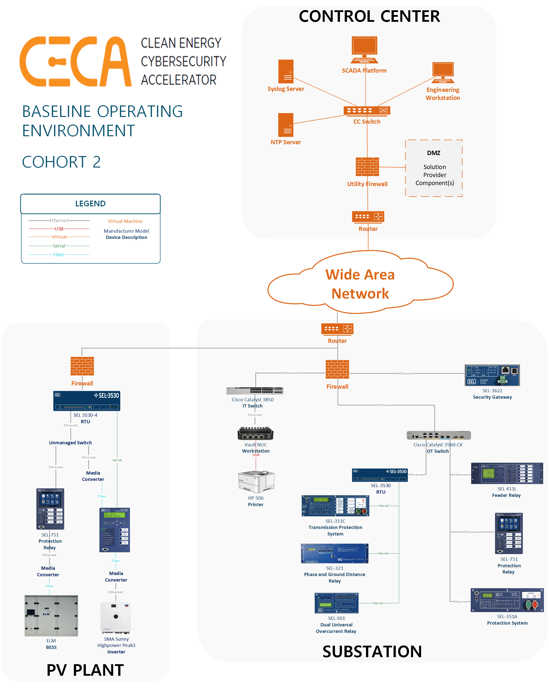

*This assesesment is slightly different than other CECA Cohorts. Previous cohorts focus on a prioritized threat, and CECA creates realistic evaluations based on APT inteligence in order to test solution's abilities to defend against these threats. However, in this Cohort, the prioritized threat focused on a blue team activity rather than a red team activitiy. In this cohort, rather than doing a threat emulation plan, a product evaluation plan was created to test how each product performs.*

# Product Evaluation Plan: Evaluating Asset Identification Solutions

CECA developed an evaluation plan based on the Cohort 2 prioritized risk-hidden risks due to incomplete system visibility-to  test the capabilities of each solution selected for the cohort. The evaluation plan detailed four scenarios that each tested several characteristics of the solution. Each individual scenario is a scientific, repeatable set of procedures and data collection methods. The testing matrix shows which characteristics were tested in each scenario.

| | [Scenario 1](./scenario-1/README.md) - Initial Discovery | [Scenario 2](./scenario-2/README.md) - Change Discovery | [Scenario 3](./scenario-3/README.md) - Alternate Discovery | [Scenario 4](./scenario-4/README.md) - Scale Discovery |
| ------------------        | ------------------- | ----------------- | ----------------- | ----------------- |
| Timing                    | ✓                   |                   |                    |  ✓               |
| Inventory accuracy        | ✓                   |                   | ✓                  |  ✓               |
| Data richness             | ✓                   |                   | ✓                  |                  |
| Additional network load   | ✓                   |                   | ✓                  |  ✓               |
| Disruption of operations  | ✓                   |                   |                    |                  |
| Change detection          |                     | ✓                 |                    |                  |
| Alert                     |                     | ✓                 |                    |  ✓               |

* **Timing:** How long does it take to identify all the assets in the environment?
* **Inventory accuracy:** How many assets in the environment did the solution correctly identify?
* **Data richness:** For each identified asset, how detailed are the data collected by the solution?
* **Additional network load:** How much additional network traffic does the solution add to the ICS network?
* **Disruption of operations:** Does the solution affect any normal operations of the ICS system?
* **Change detection:** How does the solution track changes to assets over time?
* **Alert:** Does the solution notify users of unexpected devices on the network?

**Note:** This order of evaluations focuses on an active scanning solution. Scenarios 1, 2, and 4 use active scanning, and scenario 3 uses passive sampling. For a passive sampling solution, scenarios 1, 2, and 4 would use passive sampling, and timing and disruption of operations would not be evaluated. Scenario 3 would use alternate methods like targeted active scanning, and timing and/or disruption of operations would be evaluated.

## Reports

CECA Conducted Cohort 2 testing on 2 solution providers. Detailed reports can be found for [runZero](https://www.runzero.com/) and [Asimily](https://asimily.com/) on the [CECA Cohort 2 webpage](https://www.nrel.gov/security-resilience/cybersecurity-ceca-cohort-two.html).

## Baseline Operating Environmnet (BOE)

### PV Substation Environment

Scenarios 1, 2, and 3 are all conducted in an environment that featured a basic utility control center, a clean energy-generating PV plant (i.e., solar plant), and a substation. These are represented in Figure 2. This environment was built to simulate all the complexities that a solution could be expected to deal with when identifying assets in an ICS network containing both clean energy components and legacy OT devices. The environment featured 14 different OT devices communicating over a variety of media, protocols, and firmware versions.

### AMI Environment

Scenario 4 evaluates the solution at scale, so a  larger environment featuring several thousand AMI devices on a single flat network within the subnet (10.200.1.0/20). The size of this environment represents the number of customers that could be served by a larger substation.
