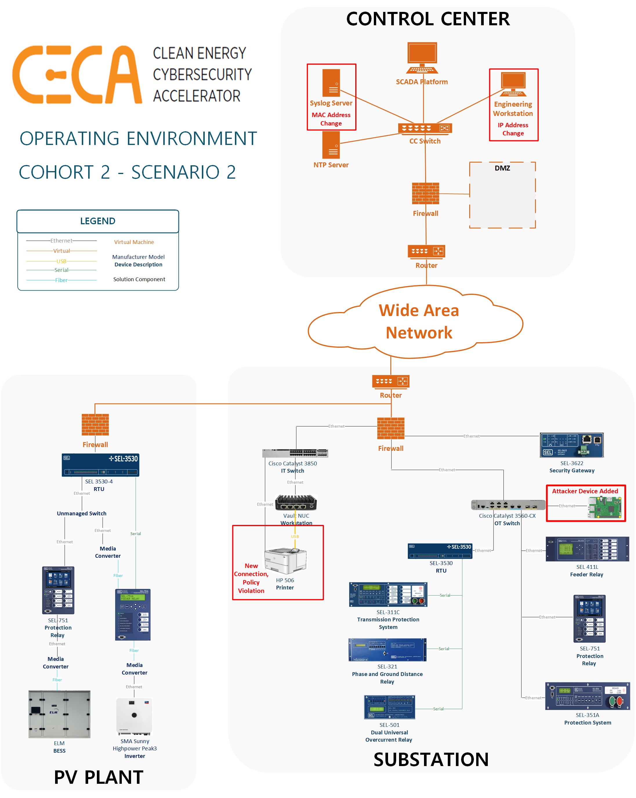

# Scenario 2: Change Discovery

This scenario focused on how a solution identifies changes to a previously analyzed environment. CECA designed this scenario as a follow-on test from Scenario 1,9 after the solution had already identified the initial assets integrated into the environment. Scenario 2 sought to understand how the solution adapted to and identified changes in the operating environment. Scenario 2 also explored a solution’s ability to detect and produce alerts based on new and/or altered devices in the environment. Such alerts are of interest to system owners to make them aware of new assets that are either intentionally or unintentionally modified or added to the environment.



## Pre-conditions

* Before scenario 2 can be run scenario 1 must be run in order to 'onboard' the solution to the environment that it is being tested in. This is tested using the 'onboarded' state after scenario 1C.
* In addition to the configurations mentioned in [scenario 1 pre-conditions](/asset-identification/scenario-1/README.md#pre-conditions), the solution should be configured to generate alerts (to the extent that the solution allows) when it identifies new devices or different environment configurations from the identified baseline.
* Before scenario 2 is run, the desired configuration changes must be made and verified in the environment. In CECA cohort 2, the following changes were made:
* **New devices**:
    * **Attacker** device: A new device was added to the environment that simulates an unauthorized attacker connecting to the network. The simulated attacker plugged in a RaspberryPi running Kali Linux OS in the substation OT subnet.
    * **Misconfigured device**: The printer in the substation IT subnet was plugged into the switch via ethernet, which represents a policy violation.
* **Changes to existing devices**:
    * The IP address of the engineering workstation in the control center was changed to 10.1.1.10, but the MAC address and all other attributes were held constant.
    * The MAC address of the syslog server in the control center was changed to 10:c5:95:ff:04:ff, but the IP address and all other attributes were held constant.

## Procedures

Scenario 2 is similar to Scenario 1 except for step 2, which uploads a previous scan to put the solution into an 'onboarded' state, and steps 4 and 14, which create and check an alert.

### Step 1 - Check AOE

Make sure that all assets in the environment are available and functioning as expected.

CECA Cohort 2 accomplishes this with the [phenix state of health app](https://phenix.sceptre.dev/latest/state-of-health/#sample-soh-scenario-config). Custom tests for each host ensure that connections and services are available and functioning as expected.

### Step 2 - Upload Previous Scan

Upload the scan results from a previous run (Scenario 1A) to put the solution into an 'onboarded' state.

CECA Cohort 2 accomplishes this with API calls, CLI commands, or GUI interactions particularized to the solution being tested.

### Step 3 - Setup Solution

Run any commands to set up or configure the solution. In addition, baseline information about the solution is collected to validate and record its settings and status before the test is started.

CECA Cohort 2 accomplishes this with API calls, CLI commands, or GUI interactions particularized to the solution being tested.

### Step 4 - Create Alert

Create an alert for new devices found during this test.

CECA Cohort 2 accomplishes this with API calls, CLI commands, or GUI interactions particularized to the solution being tested.

### Step 5 - Start Disruption to Operations Record

Record the availability of each asset throughout the scan to ensure active scanning does not affect any assets.

CECA Cohort 2 accomplishes this with [`fping`](https://fping.org/).

```bash
fping -l -p 1000 -t 300 -r 3 -D -e -f /root/monitor-ips.txt > /root/disruption-results.txt 2>&1
```

### Step 6 - Start `tcpdump` on solution agent(s) and firewalls

Start collecting network traffic on a solution's agents and firewalls.

CECA Cohort 2 accomplishes this with the [scorch](https://phenix.sceptre.dev/latest/scorch/) `tcpdump` component.

### Step 7 - Start Timer

Record the time when the solution begins running.

CECA Cohort 2 accomplishes this with `date +%s.%N > /root/timing.txt`

### Step 8 - Start the Solution Scan

Start the solution's discovery.

CECA Cohort 2 accomplishes this with API calls, CLI commands, or GUI interactions particularized to the solution being tested.

### Step 9 - Wait until the Solution is Complete

Wait until the discovery reports to be completed and then proceed.

CECA Cohort 2 accomplishes this with API calls, CLI commands, or GUI interactions particularized to the solution being tested.

### Step 10 - Stop Timer

Record the time when the solution is done running, ending the timer started in step 4.

CECA Cohort 2 accomplishes this with `date +%s.%N >> /root/timing.txt`

### Step 11 - Stop `tcpdump` on solution agent(s) and firewalls

End the `tcpdumps` started in step 4.

### Setp 12 - Stop Disruption to Operations Record

Stop recording availability of assets that was started in step 3.

### Step 13 - Extract and Save Results

Record the solution state at the end of the test.

CECA Cohort 2 accomplishes this with API calls, CLI commands, or GUI interactions particularized to the solution being tested, and the [scorch](https://phenix.sceptre.dev/latest/scorch/) `cc` component to extract files.

### Step 14 - Check Alert

Check for alerts for the new devices found during this test.

CECA Cohort 2 accomplishes this with API calls, CLI commands, or GUI interactions particularized to the solution being tested.

## Data Collected

Once the above procedures are completed, the following sources of data are retrieved and archived for further analysis:

* Solution database (`inventory.csv`)
* Solution alert (`alert.png`)
* Solution specific settings, status messages, etc.
* Results of timer (`timing.txt`)
* Results of tisruption to Operations (`*-disruption-results.txt`)
* Solution Traffic (`*.pcap`)
* AOE status (`soh.json`)

## Evaluation Criteria

* Alert
* Change Detection